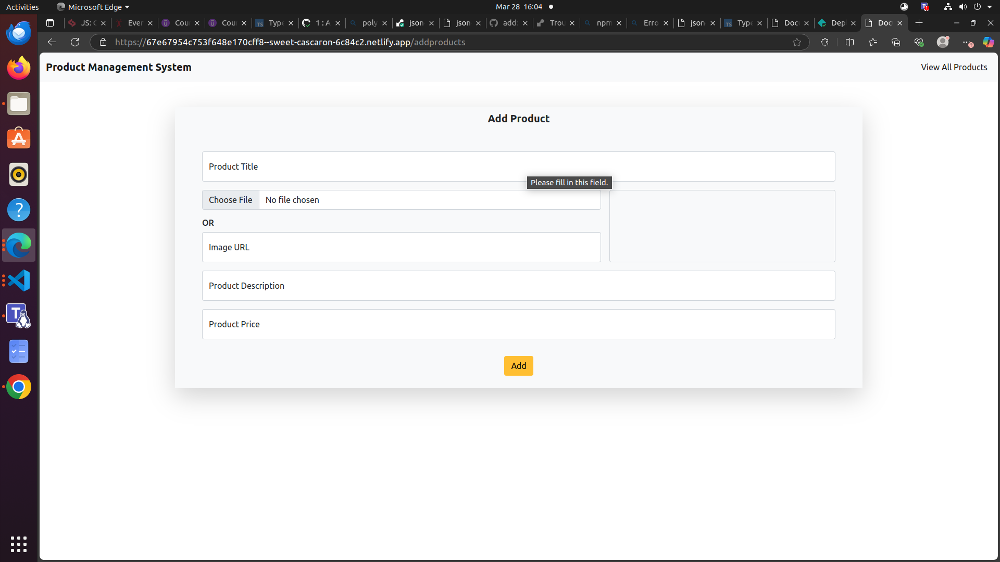
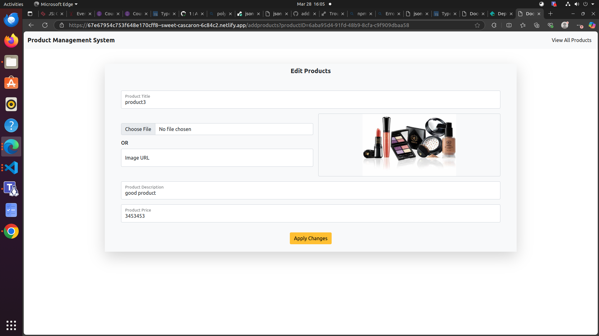

# This is CRUD application in the domain of product management.

## It has the following pages:

- View all products Page
- Add or Edit product page
- View a specific product.
- sort products based on name and price
- search products based on their name

#### I have utilised the following advanced concepts:

- Routing for different pages using JS
- Use of Parcel
- Use of JSON server
- modularity

#### Tools used:

- VS Code
- HTML
- CSS
- TS
- Bootstrap
- Parcel
- JSON-SERVER

#### Screenshots:

#### To experience the website kindly visit

https://delightful-kashata-b0aeea.netlify.app/viewallproducts

#### THANK YOU FOR VISITING
